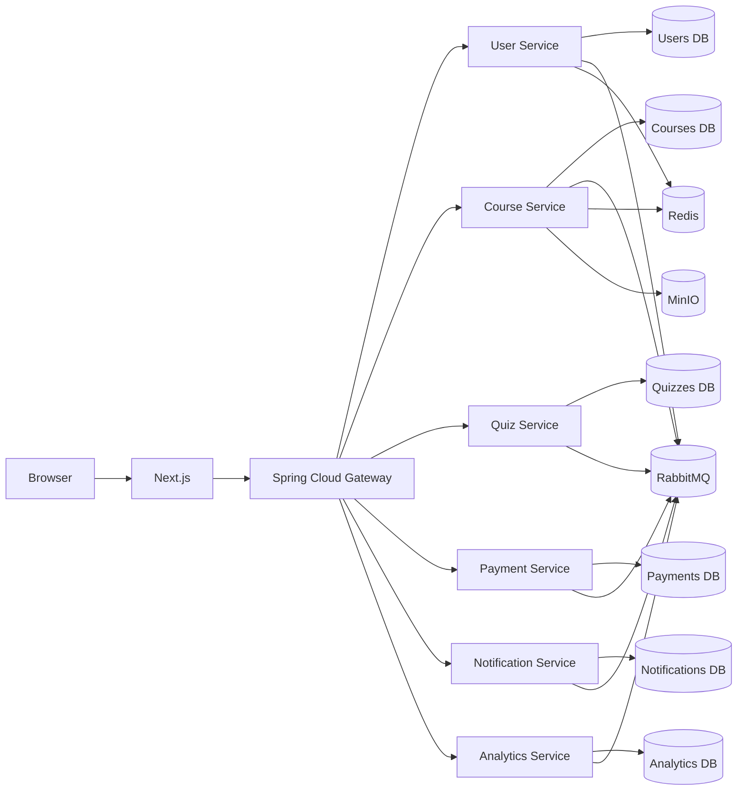

```mermaid
flowchart LR

Browser[Browser]

Frontend[Next.js]

Gateway[Spring Cloud Gateway]

UserService[User Service]
CourseService[Course Service]
QuizService[Quiz Service]
PaymentService[Payment Service]
NotificationService[Notification Service]
AnalyticsService[Analytics Service]

UsersDB[(Users DB)]
CoursesDB[(Courses DB)]
QuizzesDB[(Quizzes DB)]
PaymentsDB[(Payments DB)]
NotificationsDB[(Notifications DB)]
AnalyticsDB[(Analytics DB)]

Redis[(Redis)]
RabbitMQ[(RabbitMQ)]
MinIO[(MinIO)]

Browser --> Frontend
Frontend --> Gateway

Gateway --> UserService
Gateway --> CourseService
Gateway --> QuizService
Gateway --> PaymentService
Gateway --> NotificationService
Gateway --> AnalyticsService

UserService --> UsersDB
CourseService --> CoursesDB
QuizService --> QuizzesDB
PaymentService --> PaymentsDB
NotificationService --> NotificationsDB
AnalyticsService --> AnalyticsDB

UserService --> RabbitMQ
CourseService --> RabbitMQ
QuizService --> RabbitMQ
PaymentService --> RabbitMQ
NotificationService --> RabbitMQ
AnalyticsService --> RabbitMQ

CourseService --> Redis
UserService --> Redis

CourseService --> MinIO
```
