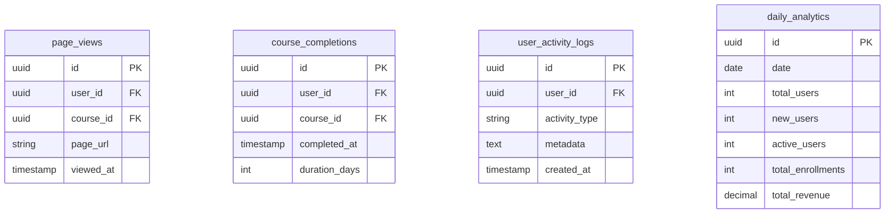

```mermaid
erDiagram
    page_views {
        uuid id PK
        uuid user_id FK
        uuid course_id FK
        string page_url
        timestamp viewed_at
    }

    course_completions {
        uuid id PK
        uuid user_id FK
        uuid course_id FK
        timestamp completed_at
        int duration_days
    }

    user_activity_logs {
        uuid id PK
        uuid user_id FK
        string activity_type
        text metadata
        timestamp created_at
    }

    daily_analytics {
        uuid id PK
        date date
        int total_users
        int new_users
        int active_users
        int total_enrollments
        decimal total_revenue
    }
```
