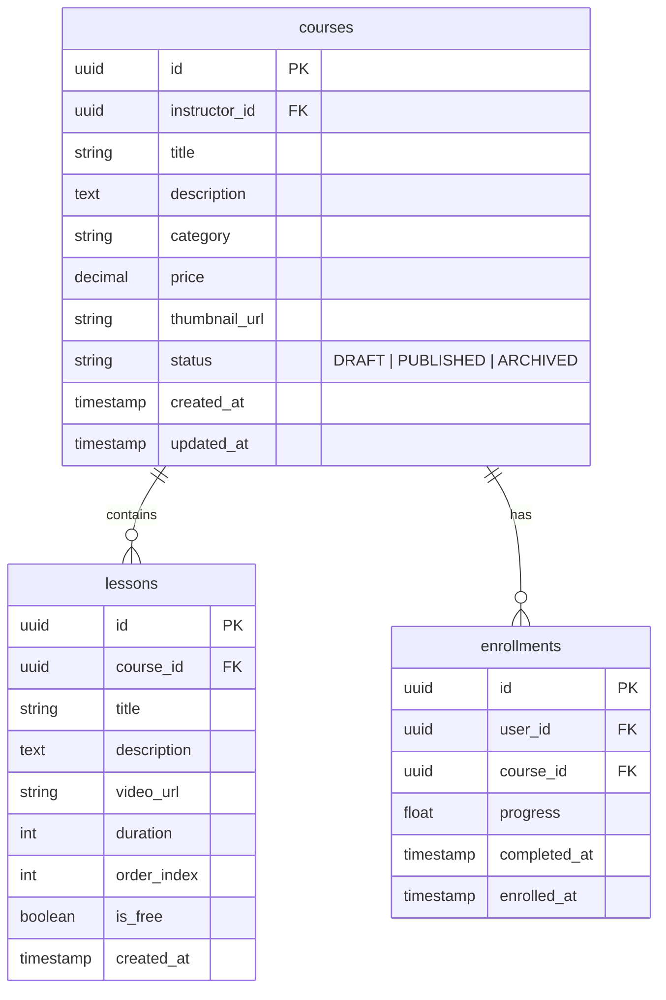

```mermaid
erDiagram
    courses {
        uuid id PK
        uuid instructor_id FK
        string title
        text description
        string category
        decimal price
        string thumbnail_url
        string status "DRAFT | PUBLISHED | ARCHIVED"
        timestamp created_at
        timestamp updated_at
    }

    lessons {
        uuid id PK
        uuid course_id FK
        string title
        text description
        string video_url
        int duration
        int order_index
        boolean is_free
        timestamp created_at
    }

    enrollments {
        uuid id PK
        uuid user_id FK
        uuid course_id FK
        float progress
        timestamp completed_at
        timestamp enrolled_at
    }

    courses ||--o{ lessons : contains
    courses ||--o{ enrollments : has
```
