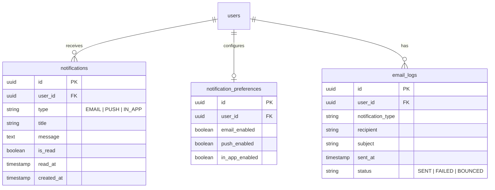

```mermaid
erDiagram
    notifications {
        uuid id PK
        uuid user_id FK
        string type "EMAIL | PUSH | IN_APP"
        string title
        text message
        boolean is_read
        timestamp read_at
        timestamp created_at
    }

    notification_preferences {
        uuid id PK
        uuid user_id FK
        boolean email_enabled
        boolean push_enabled
        boolean in_app_enabled
    }

    email_logs {
        uuid id PK
        uuid user_id FK
        string notification_type
        string recipient
        string subject
        timestamp sent_at
        string status "SENT | FAILED | BOUNCED"
    }

    users ||--o{ notifications : receives
    users ||--o| notification_preferences : configures
    users ||--o{ email_logs : has
```
