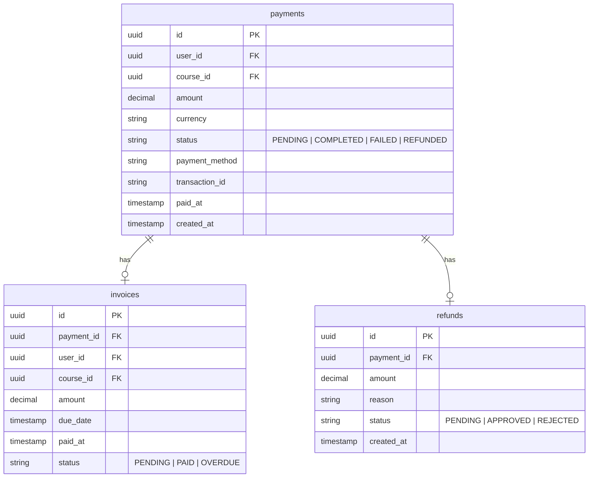

```mermaid
erDiagram
    payments {
        uuid id PK
        uuid user_id FK
        uuid course_id FK
        decimal amount
        string currency
        string status "PENDING | COMPLETED | FAILED | REFUNDED"
        string payment_method
        string transaction_id
        timestamp paid_at
        timestamp created_at
    }

    invoices {
        uuid id PK
        uuid payment_id FK
        uuid user_id FK
        uuid course_id FK
        decimal amount
        timestamp due_date
        timestamp paid_at
        string status "PENDING | PAID | OVERDUE"
    }

    refunds {
        uuid id PK
        uuid payment_id FK
        decimal amount
        string reason
        string status "PENDING | APPROVED | REJECTED"
        timestamp created_at
    }

    payments ||--o| invoices : has
    payments ||--o| refunds : has
```
