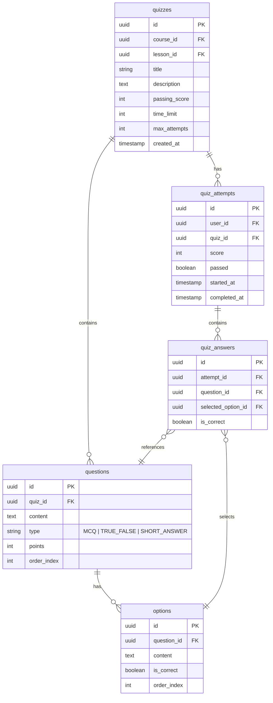

```mermaid
erDiagram
    quizzes {
        uuid id PK
        uuid course_id FK
        uuid lesson_id FK
        string title
        text description
        int passing_score
        int time_limit
        int max_attempts
        timestamp created_at
    }

    questions {
        uuid id PK
        uuid quiz_id FK
        text content
        string type "MCQ | TRUE_FALSE | SHORT_ANSWER"
        int points
        int order_index
    }

    options {
        uuid id PK
        uuid question_id FK
        text content
        boolean is_correct
        int order_index
    }

    quiz_attempts {
        uuid id PK
        uuid user_id FK
        uuid quiz_id FK
        int score
        boolean passed
        timestamp started_at
        timestamp completed_at
    }

    quiz_answers {
        uuid id PK
        uuid attempt_id FK
        uuid question_id FK
        uuid selected_option_id FK
        boolean is_correct
    }

    quizzes ||--o{ questions : contains
    questions ||--o{ options : has
    quizzes ||--o{ quiz_attempts : has
    quiz_attempts ||--o{ quiz_answers : contains
    quiz_answers }o--|| questions : references
    quiz_answers }o--|| options : selects
```
