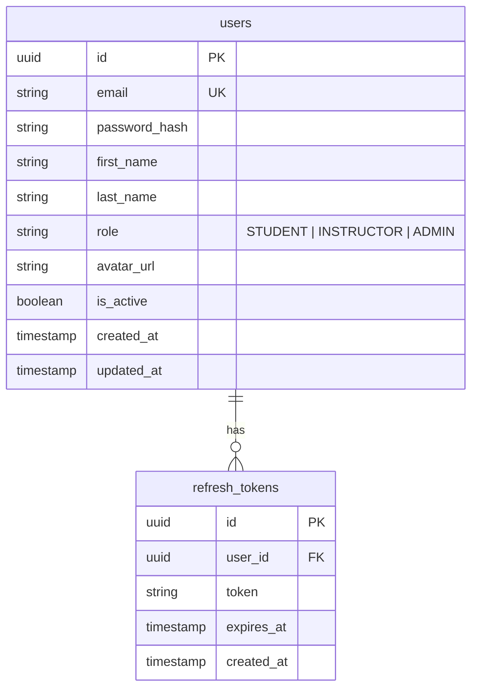

```mermaid
erDiagram
    users {
        uuid id PK
        string email UK
        string password_hash
        string first_name
        string last_name
        string role "STUDENT | INSTRUCTOR | ADMIN"
        string avatar_url
        boolean is_active
        timestamp created_at
        timestamp updated_at
    }

    refresh_tokens {
        uuid id PK
        uuid user_id FK
        string token
        timestamp expires_at
        timestamp created_at
    }

    users ||--o{ refresh_tokens : has
```
